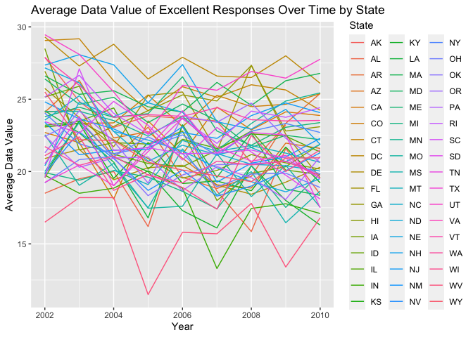

p8105_hw3_ht2630
================
Haotian Tang
2023-10-14

------------------------------------------------------------------------

Problem 2

``` r
library(tidyverse)
```

    ## ── Attaching core tidyverse packages ──────────────────────── tidyverse 2.0.0 ──
    ## ✔ dplyr     1.1.2     ✔ readr     2.1.4
    ## ✔ forcats   1.0.0     ✔ stringr   1.5.0
    ## ✔ ggplot2   3.4.3     ✔ tibble    3.2.1
    ## ✔ lubridate 1.9.2     ✔ tidyr     1.3.0
    ## ✔ purrr     1.0.2     
    ## ── Conflicts ────────────────────────────────────────── tidyverse_conflicts() ──
    ## ✖ dplyr::filter() masks stats::filter()
    ## ✖ dplyr::lag()    masks stats::lag()
    ## ℹ Use the conflicted package (<http://conflicted.r-lib.org/>) to force all conflicts to become errors

``` r
library(ggridges)
library(patchwork)
library(p8105.datasets)

data("brfss_smart2010") 

health_df = brfss_smart2010

colnames(health_df) = c("Year", "Location_Abbreviation", "Location_Description", "Class", "Topic", "Health_Question", "Response", "Sample_Size", "Data_value", "Confidence_Limit_Low", "Confidence_Limit_High", "Display_Order", "Data_Value_Unit", "Data_Value_Type", "Data_Value_Footnote_Symbol", "Data_Value_Footnote", "Data_Source", "Class_ID", "Topic_ID", "Location_ID", "Question_ID", "RESP_ID", "Geographic_Location") 
  
  health_df = subset(health_df, Topic == "Overall Health" & Response %in% c("Excellent", "Very Good", "Good", "Fair", "Poor")) |> 

  mutate(Response = factor(Response, levels = c("Poor", "Fair", "Good", "Very Good", "Excellent"), ordered = TRUE))
  
Year_2002 = subset(health_df, Year == 2002) |> 
  group_by(Location_Abbreviation) |> 
  summarise(n_occurrences = n()) |> 
  filter(n_occurrences >= 7)
 
Year_2010 = subset(health_df, Year == 2010) |> 
  group_by(Location_Abbreviation) |> 
  summarise(n_occurrences = n()) |> 
  filter(n_occurrences >= 7)
```

So in 2002, states are AZ, CO, CT, DE, FL, GA, HI, ID, IL, IN, KS, LA,
MA, MD, ME, MI, MN, MO, NC, NE, NH, NJ, NV, NY, OH, OK, OR, PA, RI, SC,
SD, TN, TX, UT, VT, WA. In 2010, states are AL, AR, AZ, CA, CO, CT, DE,
FL, GA, HI, IA, ID, IL, IN, KS, LA, MA, MD, ME, MI, MN, MO, MS, MT, NC,
ND, NE, NH, NJ, NM, NV, NY, OH, OK, OR, PA, RI, SC, SD, TN, TX, UT, VT,
WA, WY.

``` r
Excellent_health_df = health_df |> 
  filter(Response == "Excellent") |> 
  group_by(Year, Location_Abbreviation) |>
  summarise(average_data_value = mean(Data_value, na.rm = TRUE))
```

    ## `summarise()` has grouped output by 'Year'. You can override using the
    ## `.groups` argument.

``` r
ggplot(Excellent_health_df, aes(x = Year, y = average_data_value, group = Location_Abbreviation, color = Location_Abbreviation)) +
  geom_line() +
  ggtitle("Average Data Value of Excellent Responses Over Time by State") +
  xlab("Year") +
  ylab("Average Data Value") +
  scale_color_discrete(name = "State")
```

<!-- -->

``` r
NY_health_df = health_df |> 
  filter(Location_Abbreviation == "NY" & Year %in% c(2006, 2010))

ggplot(NY_health_df, aes(x = Data_value, fill = Response)) +
  geom_histogram(binwidth = 6) +
  facet_wrap(~ Year) +
  ggtitle("Distribution of Data Value for Years 2006 and 2010 in NY State") +
  xlab("Data Value") +
  ylab("Frequency")
```

<!-- -->

------------------------------------------------------------------------

Problem 3
