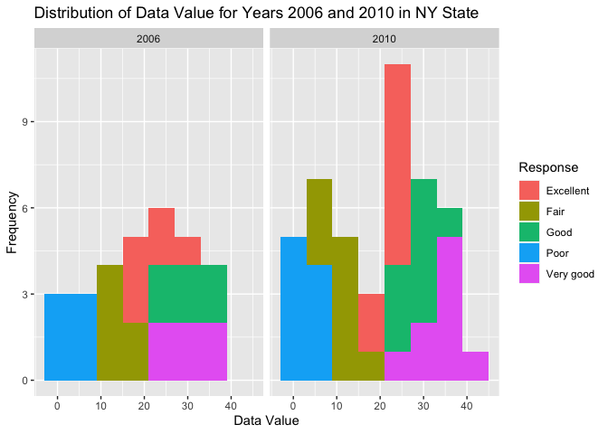

p8105_hw3_ht2630
================
Haotian Tang
2023-10-14

------------------------------------------------------------------------

Problem 2

``` r
library(tidyverse)
```

    ## ── Attaching core tidyverse packages ──────────────────────── tidyverse 2.0.0 ──
    ## ✔ dplyr     1.1.2     ✔ readr     2.1.4
    ## ✔ forcats   1.0.0     ✔ stringr   1.5.0
    ## ✔ ggplot2   3.4.3     ✔ tibble    3.2.1
    ## ✔ lubridate 1.9.2     ✔ tidyr     1.3.0
    ## ✔ purrr     1.0.2     
    ## ── Conflicts ────────────────────────────────────────── tidyverse_conflicts() ──
    ## ✖ dplyr::filter() masks stats::filter()
    ## ✖ dplyr::lag()    masks stats::lag()
    ## ℹ Use the conflicted package (<http://conflicted.r-lib.org/>) to force all conflicts to become errors

``` r
library(dplyr)
library(ggridges)
library(patchwork)
library(p8105.datasets)

data("brfss_smart2010") 

health_df = brfss_smart2010

colnames(health_df) = c("Year", "Location_Abbreviation", "Location_Description", "Class", "Topic", "Health_Question", "Response", "Sample_Size", "Data_value", "Confidence_Limit_Low", "Confidence_Limit_High", "Display_Order", "Data_Value_Unit", "Data_Value_Type", "Data_Value_Footnote_Symbol", "Data_Value_Footnote", "Data_Source", "Class_ID", "Topic_ID", "Location_ID", "Question_ID", "RESP_ID", "Geographic_Location")
  
health_df = subset(health_df, Topic == "Overall Health" & Response %in% c("Poor", "Fair", "Good", "Very good", "Excellent"))

filtered_health_df = health_df |>
  filter(Topic == "Overall Health", Response %in% c("Poor", "Fair", "Good", "Very good", "Excellent")) |>
  mutate(Response = factor(Response, levels = c("Excellent", "Very good", "Good", "Fair", "Poor"), ordered = TRUE))
```

``` r
Year_2002 = subset(health_df, Year == 2002) |> 
  group_by(Location_Abbreviation) |> 
  summarise(n_occurrences = n()) |> 
  filter(n_occurrences >= 7)
 
Year_2010 = subset(health_df, Year == 2010) |> 
  group_by(Location_Abbreviation) |> 
  summarise(n_occurrences = n()) |> 
  filter(n_occurrences >= 7)
```

So in 2002, states are AZ, CO, CT, DE, FL, GA, HI, ID, IL, IN, KS, LA,
MA, MD, ME, MI, MN, MO, NC, NE, NH, NJ, NV, NY, OH, OK, OR, PA, RI, SC,
SD, TN, TX, UT, VT, WA. In 2010, states are AL, AR, AZ, CA, CO, CT, DE,
FL, GA, HI, IA, ID, IL, IN, KS, LA, MA, MD, ME, MI, MN, MO, MS, MT, NC,
ND, NE, NH, NJ, NM, NV, NY, OH, OK, OR, PA, RI, SC, SD, TN, TX, UT, VT,
WA, WY.

``` r
Excellent_health_df = health_df |> 
  filter(Response == "Excellent") |> 
  group_by(Year, Location_Abbreviation) |>
  summarise(average_data_value = mean(Data_value, na.rm = TRUE))
```

    ## `summarise()` has grouped output by 'Year'. You can override using the
    ## `.groups` argument.

``` r
ggplot(Excellent_health_df, aes(x = Year, y = average_data_value, group = Location_Abbreviation, color = Location_Abbreviation)) +
  geom_line() +
  ggtitle("Average Data Value of Excellent Responses Over Time by State") +
  xlab("Year") +
  ylab("Average Data Value") +
  scale_color_discrete(name = "State")
```

<!-- -->

``` r
NY_health_df = health_df |> 
  filter(Location_Abbreviation == "NY" & Year %in% c(2006, 2010))

ggplot(NY_health_df, aes(x = Data_value, fill = Response)) +
  geom_histogram(binwidth = 6) +
  facet_wrap(~ Year) +
  ggtitle("Distribution of Data Value for Years 2006 and 2010 in NY State") +
  xlab("Data Value") +
  ylab("Frequency")
```

<!-- -->

------------------------------------------------------------------------

Problem 3

``` r
nhanes_covar = read_csv("nhanes_covar.csv", skip = 4) |> 
 
  mutate(sex = recode(sex, '1' = 'Male', '2' = 'Female')) |> 
  mutate(education = recode(education, '1' = 'Less than high school', '2' = 'High school equivalent', '3' = 'More than high school')) |>
  drop_na(sex, age, BMI, education) |>
  filter(age >= 21)
```

    ## Rows: 250 Columns: 5
    ## ── Column specification ────────────────────────────────────────────────────────
    ## Delimiter: ","
    ## dbl (5): SEQN, sex, age, BMI, education
    ## 
    ## ℹ Use `spec()` to retrieve the full column specification for this data.
    ## ℹ Specify the column types or set `show_col_types = FALSE` to quiet this message.

``` r
nhanes_accel = read_csv("nhanes_accel.csv") 
```

    ## Rows: 250 Columns: 1441
    ## ── Column specification ────────────────────────────────────────────────────────
    ## Delimiter: ","
    ## dbl (1441): SEQN, min1, min2, min3, min4, min5, min6, min7, min8, min9, min1...
    ## 
    ## ℹ Use `spec()` to retrieve the full column specification for this data.
    ## ℹ Specify the column types or set `show_col_types = FALSE` to quiet this message.

``` r
Merged_data = merge(nhanes_covar, nhanes_accel, by = "SEQN")|>
  
  mutate(
    education = fct_relevel(education, c("Less than high school", "High school equivalent", "More than high school"))
  )
  
  ggplot(Merged_data, aes(x = age, fill = sex)) + 
  geom_histogram(alpha = 0.5, position = 'identity', bins = 30) +
  facet_grid(~ education) +
  labs(title = "Age Distribution by Gender and Education",
       x = "Age",
       y = "Frequency") +
  scale_fill_manual(values = c("Male" = "yellow", "Female" = "red"))
```

<!-- -->

``` r
Gender_education_table = Merged_data |> 
  group_by(sex, education) |> 
  summarise(count = n()) |>
  spread(key = sex, value = count, fill = 0)
```

    ## `summarise()` has grouped output by 'sex'. You can override using the `.groups`
    ## argument.

Comment: Males and females have close values in the education of being
less than high school and more than high school, but there are more
males in high school equivalent, about 35 while the number of females is
23.

From the graph, we can see males and females have similar numbers of
being less than high school and high school equivalent at all ages. The
nuance is that there are slightly more females of older ages. However,
females are more than males with education more than high school in all
ages, specifically in younger ages.

``` r
Merged_data = Merged_data |> 
  mutate(total_activity = rowSums(select(Merged_data, starts_with("min"))))  

  ggplot(Merged_data, aes(x = age, y = total_activity, color = sex)) +
  geom_point() +
  geom_smooth(method = "lm", se = FALSE) +
  facet_wrap(~ education, scales = "free") +
  labs(
    title = "Total Activity vs. Age Stratified by Gender and Education Level",
    x = "Age",
    y = "Total Activity",
    color = "Gender"
  ) 
```

    ## `geom_smooth()` using formula = 'y ~ x'

<!-- -->
Comment: In the group of being less than high school, males and females
tend to have similar scatterplot and trendline. But males have lower
activity than female with education of being high school equivalent. But
their rate of decrease (slope) are close. For those whose education is
more than high school, females are still higher than males, and their
rate of decrease are still similar. One important obervation is that
across three groups, the slope is less steap, which means people with
high education tend to have lower rate of activity decrease.

``` r
Longer_merged_data = Merged_data |> 
  pivot_longer(cols = starts_with("min"), names_to = "minute", values_to = "acceleration")

Average_data = Longer_merged_data |>
  group_by(education, sex, minute) |>
  summarise(mean_acceleration = mean(acceleration, na.rm = TRUE), .groups = 'drop')

ggplot(Average_data, aes(x = as.numeric(sub("min", "", minute)), y = mean_acceleration, color = sex)) +
  geom_line() +
  geom_smooth(method = "loess", span = 0.2) +
  facet_wrap(~ education, ncol = 1) +
  labs(
    title = "24-hour Activity Time Courses at Different Education Levels",
    x = "Time of Day (Minutes)",
    y = "Average Accelerometer Reading",
    color = "Sex"
  ) +
  scale_x_continuous(limits = c(0, 1440), breaks = seq(0, 1440, 240)) +
  theme_minimal()
```

    ## `geom_smooth()` using formula = 'y ~ x'

<!-- -->
Comment: Similarly, we can see males and females are similar in the
group of “less than high school”. Males have slightly lower average
accelerometer reading in the group of “high school equivalent”. However,
there is obvious difference between males and females with highest
education levels. The difference is more significant in the middle parts
(360 to 1200) of minutes but less in two sides. It also supports the
comments made above.
